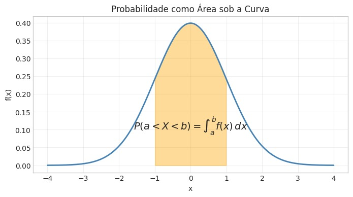

  
# Perfil Profissional | Machine Learning, Dados e Crédito
Documento de referência com minha experiência em Dados, Crédito, Risco e Machine Learning.

## Discurso de apresentação

  
- **Obrigado pela oportunidade**.  

    - Sou o [Moacir Magalhães Faria](#senior),  
    - tenho mais de 15 anos de experiência trabalhando com: 
        - dados, 
        - crédito, 
        - risco e 
        - operações financeiras, 
    - principalmente no setor imobiliário.

 

- **Minha carreira se apoia em três pilares**:

| **Análise e modelagem financeira**: | **Arquitetura e engenharia de dados** | **Storytelling analítico** |
|-|-|-|
| - inadimplência,   - risco,   - comportamento de carteira,   - capacidade de pagamento,   - projeções e   - KPIs. | - integração via APIs,   - pipelines,   - governança,   - modelagem em PostgreSQL e   - criação de camadas analíticas. | - transformar dados em decisões,   - apresentar insights para diretoria e   - conectar análise com impacto financeiro. |

 

- Minha principal força é transformar dados em decisões, conectando: 
    - indicadores, 
    - risco e 
    - impacto financeiro.

 

- Nos últimos anos **evoluí para a área de dados** de forma estruturada, atuando como: 

    - Cientista de Dados e FP&A Partner

        - construindo pipelines, 
        - modelos analíticos e 
        - dashboards executivos.

 

- **Sobre [Machine Learning](#etapas)**, 

    - **eu domino o ciclo completo**: 
        - preparação de dados, 
        - feature engineering, 
        - validação, 
        - tuning e 
        - interpretação. 
    
    - **Tenho estudado e praticado** com profundidade
        - certificações da Kaggle e 
            - Intermediate Machine Learning
            - Machine Learning Explainability
            - Data Cleaning
        - certificação IBM 
            - Statistics for Data Science with Python
        
    > e estou pronto para aplicar isso em modelos produtivos.

 

- "Minha **experiência em [Crédito e Risco](#credito)** é prática, profunda e construída ao longo de 15 anos de atuação direta.”  
**Isso me dá uma visão clara e rápida sobre**: 
    - quais variáveis fazem sentido, 
    - como interpretar resultados e 
    - como traduzir modelos para o negócio.
- Levando ao entendimento d**o que realmente importa para modelos de risco e crédito**."

 

> Estou buscando uma oportunidade onde eu possa unir minha experiência de crédito e dados  
> com a evolução em machine learning, contribuindo com impacto real para o negócio.”

  

 

# Apêndice
---

 

## Machine Learning → 🧠📊 
[↑ - Discurso](#mldiscurso)

 👉 Etapas ML 
 

 

| Etapas ML | O que é | Como explicar | Incluí | Ferramentas |
|-|-|-|-|-|
| Preparação | Limpar e organizar dados | “**Deixar a base consistente e pronta para modelar**”    “Tenho experiência prática com preparação de dados usando Pandas e NumPy, integrando dados financeiros, comerciais e de crédito vindos de ERP, CRM e APIs.” | - Tratamento de nulos   - Padronização   (datas, categorias, strings)   - Remoção de duplicidades   - Correção de inconsistências   - Normalização   - Junção fontes (merge/join)   - Detecção de outliers | - **Pandas**   (merge, groupby, fillna, astype, datetime)   - **NumPy**   (operações vetorizadas, máscaras, transformações) |
| Feature Engineering | Criar variáveis úteis | “**Transformar dados brutos em informação preditiva.**”    “Minha experiência em crédito me ajuda a criar variáveis relevantes para risco, como comportamento de carteira, aging e capacidade de pagamento.” | - Encoding   - indicadores derivados   - Variáveis categóricas/temporais   - Variáveis de comportamento   - Agregações (clientes/contratos)   - Transformações matemáticas (log, binning, normalização) | - **Pandas**   (rolling, shift, diff, apply)   - **Scikit-Learn**   (OneHotEncoder, StandardScaler, PolynomialFeatures) |
| Validação | Testar o modelo | “**Garantir modelos generalizados sem overftting.**”    “Uso validação cruzada e métricas adequadas para garantir estabilidade e evitar overfitting.” | - Treino/teste   - Validação cruzada (k-fold)   - Métricas adequadas   (AUC, KS, recall, precision, RMSE)   - Comparação entre modelos   - Avaliação de estabilidade | - **Scikit-Learn**   (train_test_split, cross_val_score, metrics) |
| Tuning | Ajustar hiperparâmetros | “**Melhorar performance com ajustes finos.**”    “Tenho prática com tuning usando GridSearch e RandomSearch em exercícios e projetos de estudo.” | - GridSearchCV   - RandomizedSearchCV   - Ajustes de:   --profundidade,   --learning rate,   -- número de árvores   - Regularização (L1/L2) | - **Scikit-Learn**   (GridSearchCV, RandomizedSearchCV)   - **XGBoost / CatBoost**   (parâmetros avançados) |
| Interpretação | Explicar o modelo | “**Traduzir o modelo para o negócio.**”    “Minha experiência em storytelling analítico me ajuda a traduzir resultados de modelos para áreas de negócio.” | - SHAP values   - Feature importance   - Permutation importance   - Partial dependence plots   - Tradução para áreas de negócio | - **SHAP**   - **Scikit-Learn**   (permutation importance) |

  

## Estátistica → 📊📈 

 👉 Exemplo visual — Distribuição Normal e Z-score 
 

 

A interpretação estatística é essencial para entender padronização, outliers e comportamento de variáveis.  
A imagem abaixo ilustra o conceito de probabilidade como área sob a curva:

A área sombreada representa a probabilidade de uma variável assumir valores entre *a* e *b*.  

- Esse conceito é a base para:
    - cálculo de Z‑score,
    - identificação de valores extremos,
    - avaliação de risco,
    - normalização de variáveis para modelos de ML.

  

## Crédito e Risco → 💲
[↑ - Discurso](#creditodiscurso)

 👉 Experiência/knowHow 
 

 

- **Crédito** 
    - **15 anos de experiência prática em** 

        

        
 Crédito e risco 

        - “Fazia análises de risco PF e PJ, avaliando capacidade de pagamento, histórico, garantias e comportamento financeiro.  
        Conectava risco com impacto no fluxo de caixa e na margem das operações.”
        

    
        

        
 Funil de crédito 

    
        - “Trabalhei com o funil completo de crédito: desde a análise inicial até a aprovação, formalização e acompanhamento pós-concessão.
        Isso me permite entender onde surgem gargalos e como dados podem melhorar conversão e qualidade.”
        

        

        
 Capacidade de pagamento 

        - “Construí indicadores de capacidade de pagamento considerando renda, compromissos, fluxo de caixa e comportamento histórico.  
        Isso ajudou a reduzir concessões arriscadas e melhorar a qualidade da carteira.”
        

        

        
 inadimplência 

        - “Trabalhei diretamente com inadimplência, analisando aging, curvas de atraso, comportamento de pagamento e projeções de default.   
        Acompanhei a evolução da carteira e identifiquei padrões de risco que ajudaram a ajustar políticas e melhorar a recuperação.”
        

        

        
 KPIs de risco e liquidez 

        - “Construí e acompanhei KPIs de risco como inadimplência, roll rate, aging e comportamento de carteira,   conectando esses indicadores ao impacto financeiro e operacional.”
        

        
        

        
 Operações estruturadas 

        - “Participei de operações estruturadas envolvendo recebíveis imobiliários, repasses bancários e auditoria de lastro.  
        Isso me deu visão clara de risco, governança e requisitos regulatórios.”
        

        

        
 Auditoria financeira e due diligence 

        
        - “Tenho experiência prática em auditoria financeira e due diligence, avaliando lastro, contratos, fluxo de caixa e consistência de informações para operações estruturadas e repasses.   Isso me dá uma visão muito sólida de risco e governança.”
        

        

        
 Elegibilidade de recebíveis 

        - “Fazia análise de elegibilidade de recebíveis para operações estruturadas,   avaliando risco, liquidez, histórico de pagamento e aderência às regras dos bancos parceiros.”
        

        

        
 Comportamento de carteira 

        - “Monitorava comportamento de carteira por cohort e vintage, analisando como grupos de clientes evoluíam ao longo do tempo.  
        Isso ajudava a identificar deterioração precoce e ajustar políticas de crédito.”
        

        

        
 Repasses bancários 

        - “Tenho experiência com repasses bancários, desde a análise de elegibilidade até o acompanhamento da carteira repassada.   Isso me deu uma visão clara de risco, governança e requisitos operacionais.”
        

        
        

        
 Funil de vendas 

        - “Tenho experiência prática com o funil de vendas de crédito, analisando conversão, comportamento do cliente e gargalos operacionais.   Isso me ajuda a conectar dados com impacto direto na originação e na qualidade da carteira.”
        

 

> “**Essa vivência me permite entender rapidamente quais variáveis fazem sentido para modelos de risco.**”
> - comportamento, 
> - capacidade de pagamento, 
> - inadimplência e 
> - qualidade da carteira.  

  

## Senioridade → 🦉
[↑ - Discurso](#seniordiscurso)

 👉 Interseção entre dados, crédito e análise. 
 

- **Moacir Magalhães**
    - Minha senioridade vem da combinação de: 
        - Visão de Negócio, 
        - Profundidade Técnica e 
        - Experiência Prática em Crédito e Dados.
    
    - Tenho autonomia para conduzir projetos ponta a ponta 
        - da definição do problema à entrega executiva 
        - orientando times e 
        - garantindo clareza nas decisões.

    - **Ao longo da carreira, atuei como referência em:**  

        

        
 Arquitetura de dados 
  

        - Estruturei pipelines, camadas analíticas e integrações via API para suportar decisões financeiras e operacionais.
        

        

        
 Engenharia de dados aplicada ao negócio 
  

        - Transformei dados brutos em bases confiáveis para crédito, risco, FP&A e operações.
        

        

        
 FP&A técnico 
  

        - Conectei dados, projeções e indicadores ao impacto financeiro real.
        

        

        
 Governança e qualidade de dados 
  

        - Garantia de integridade, consistência e rastreabilidade — essencial para crédito e operações estruturadas.
        

        

        
 Storytelling analítico 

        
        - Traduzi análises complexas em decisões claras para diretoria, fundos e parceiros financeiros.
        

        

        
 Crédito e risco 
  

        - Experiência profunda em inadimplência, comportamento de carteira, elegibilidade de recebíveis e repasses bancários.
        

        

        
 Modelagem financeira e analítica 

        - Construção de indicadores, projeções, análises de sensibilidade e modelos de risco.
        

        

        
 Liderança e autonomia 

        - Condução de projetos ponta a ponta, orientação de times e tomada de decisão com maturidade.
        

 

> “Minha senioridade está na interseção entre dados, crédito e análise.  
> Machine Learning é uma evolução natural do que já faço.”
    

  
[↑ - Topo](#topo)
